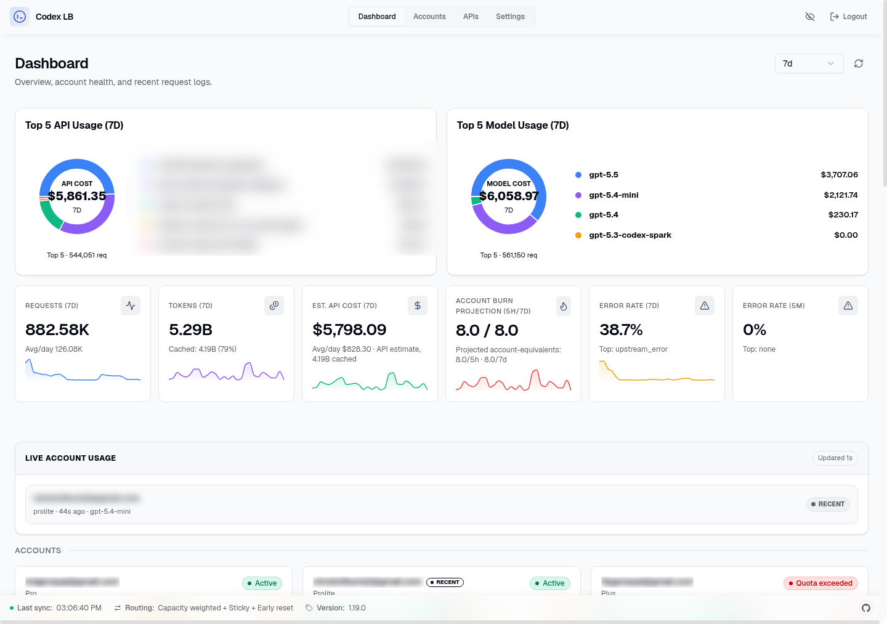
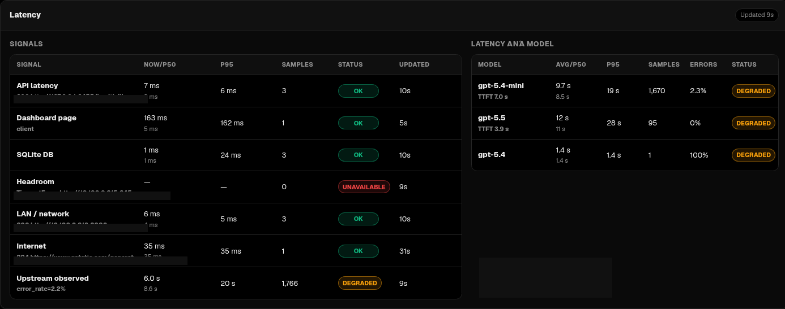
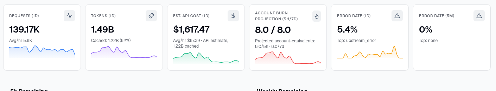
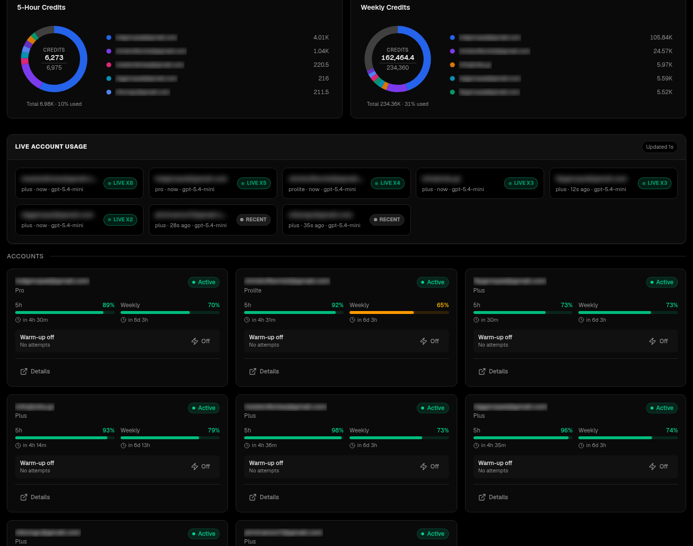

# codex-lb

Public-safe OLL4 Docker overlay for [Soju06/codex-lb](https://github.com/Soju06/codex-lb).

This repository does not republish the full upstream application source. It keeps the OLL4-specific overlay, patch stack, screenshots, and verification helpers that we apply on top of the upstream `ghcr.io/soju06/codex-lb:latest` image.

## Release Snapshot

Latest public overlay notes: [docs/releases/2026-06-25-public-overlay.md](docs/releases/2026-06-25-public-overlay.md)

New public-source changes in this release:

- normalize `prolite` plan aliases across account, rate-limit, and balancer logic
- map `prolite` and `pro` to the larger OLL4 quota/capacity model
- add explicit account-plan priorities
- prevent stale auth-refresh or usage-sync events from silently downgrading a persisted account plan

Latest verified live OLL4 capabilities documented in this repo:

- dashboard overview with Top 5 API and model usage, burn projection, and 5-minute error context
- latency panel with signal health, per-model latency, and upstream-route drilldown
- live account usage strip with privacy-aware rendering and live/recent activity pills
- current quota and remaining-credit dashboard cards
- balanced account-routing health and guarded failover behavior
- OpenAI-compatible API fixes, clipboard reliability, and overlay-only dashboard hardening

## Screenshot Gallery

All screenshots below are redacted for public release.

### Overview Dashboard

### Latency and Route Observability

### Error-Rate Companion Metric

### Remaining Credits and Live Usage

## Upstream Attribution

- Original upstream repository: `Soju06/codex-lb`
- Upstream image base used here: `ghcr.io/soju06/codex-lb:latest`
- Upstream project license remains with the upstream repository

## What OLL4 Changed

### API and compatibility

- OpenAI-compatible API compatibility fixes
- model compatibility and overflow handling patches
- weekly-remaining helper endpoint for quota consumers

### Routing and failover

- auto-model routing helpers
- overload-aware retry and failover behavior
- plan-priority routing hooks
- guarded account-plan persistence to avoid stale lower-tier overwrites

### Dashboard overlay

- clipboard reliability fixes for OAuth and dashboard flows
- live account usage rendering and privacy-aware blur handling
- quota/capacity dashboard overlays for OLL4 account plans
- release gallery for the latest verified runtime features

### Operations

- rebuild and verification helpers for overlay rollout
- CI validation for patch scripts and shell helpers

## What This Repo Contains

- `Dockerfile` for building the OLL4 overlay on top of the upstream image
- `patch-*.py` scripts for public-safe runtime modifications
- `docs/releases/*.md` release notes and public-safe change analysis
- `docs/screenshots/` redacted screenshots of the verified dashboard features
- `upgrade-and-verify.sh` for rebuild and redeploy verification
- `verify-compat.sh` for post-upgrade smoke validation

## Intentionally Excluded

- `.env` files, private credentials, and tokens
- runtime SQLite stores, backups, and environment snapshots
- internal deployment bundles, service dumps, and secret-bearing runtime captures
- account-specific internal routing customizations
- ad-hoc operational artifacts that do not belong in a public source repo

## License

The overlay files in this repository are released under the MIT License. See [LICENSE](LICENSE).
